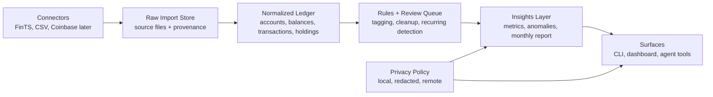

# Product Iterations - Plan

## Implementation status (as of 2026-09-02)

Recorded here because the unit sections below are written in planning voice and do not otherwise say what has shipped.

- **U1** — delivered and merged in PR #9 (`main` at `bc87c32`). Issue #1 closed.
- **U2** — implemented but **not merged**. Lives on local branch `u2-ledger-codex` (`460a455`, 76 tests green); a second independent implementation sits on `u2-ledger-grok`. Issue #2 remains open until one merges. The delivered shape differs from the U2 prediction below: it added `src/personal_finance_agent/private_files.py` and `tests/test_private_files.py`, and did not create `tests/fixtures/`.
- **U3-U8** — not started.

The per-unit `Files:` lists throughout this document are planning-time predictions, not records of what exists. Where a listed path was never created, it is marked inline below.

## Goal Capsule

**Objective:** Package Mentat into a sequence of product iterations that first solves private personal use with European banks, then expands into dashboards, tagging, reporting, and agent-native interaction.

**Product authority:** The public repo is local-first and Europe-first. Personal bank/runtime details stay private; public work should use reusable DACH examples rather than personal account identifiers.

**Open blockers:** None for planning. Execution-time unknowns remain around exact AqBanking output variants, bank-specific FinTS behavior, and which LLM providers users configure.

---

## Summary

The recommended product path is to make the CLI and local data model the source of truth, then layer human and agent surfaces on top. The first public “wow” should be a private monthly report for a real German/Austrian bank stack, because it forces the core loop to work end-to-end: connect/import, normalize, tag enough transactions, compute useful metrics, and explain changes without leaking data.

The first iterations should optimize for one user getting reliable value locally before adding broad connector coverage. The project becomes useful to others when the personal workflow is generalized into templates, adapters, and privacy modes rather than hard-coded bank knowledge.

---

## Problem Frame

People in Europe often have finances spread across FinTS-capable banks, app-first banks, brokers, crypto exchanges, spreadsheets, and PDFs. Existing apps either cost money, keep data in a vendor cloud, lack agent-friendly interfaces, or do not fit local privacy preferences.

Mentat should become a local single source of interaction: a tool humans can use directly and agents can operate safely through the same commands, manifests, and audit trail.

---

## Product Contract

### Requirements

- **R1. Local-first trust boundary:** The tool must keep runtime banking config, generated financial data, and credentials local by default.
- **R2. Personal-first bank workflow:** The first production-grade workflow must support a German/Austrian early adopter stack, starting with AqBanking/FinTS and import fallbacks for banks, brokers, and crypto.
- **R3. Unified local ledger:** The tool must normalize balances, transactions, holdings, accounts, tags, and provenance into a stable local data model.
- **R4. Expense tagging:** Users must be able to classify transactions through deterministic rules first, with optional LLM assistance that proposes rather than silently mutates.
- **R5. Monthly reporting:** Users must be able to generate a private monthly report with metrics, anomalies, and insight narratives.
- **R6. Privacy-selectable LLM routing:** Reporting and tagging assistance must support local-only operation and optional remote providers with explicit redaction modes.
- **R7. Human and agent parity:** Every meaningful action must be available through a CLI/API contract that supports human-readable output and machine-readable output.
- **R8. Public reusable posture:** Public issues, docs, examples, and tests must avoid personal identifiers while remaining useful for German/Austrian users.

### Acceptance Examples

- **AE1. FinTS first value:** A user can configure an AqBanking PIN/TAN user, fetch accounts, and export balances without storing a PIN.
- **AE2. Import fallback:** A user can import a broker or app-bank CSV into the same local ledger used by FinTS data.
- **AE3. Tagging review:** The tool can propose tags for unreviewed transactions, explain rule/LLM provenance, and let the user accept or override them.
- **AE4. Private monthly report:** The tool can produce a monthly report without sending raw transaction data to a remote LLM.
- **AE5. Agent operation:** An agent can inspect available accounts/import status, request a report, and apply approved tag changes through documented commands.

### Scope Boundaries

#### In Scope

- CLI-first workflows for setup, import, tagging, reporting, and local data inspection.
- Local data model and provenance.
- AqBanking/FinTS as the first live bank backend.
- CSV/manual imports for brokers, app banks, and crypto as practical fallback paths.
- LLM provider abstraction with local model support and explicit privacy modes.
- Minimal dashboard after the ledger/reporting primitives exist.

#### Deferred to Follow-Up Work

- Full multi-country Open Banking provider integrations.
- Mobile apps.
- Tax filing automation.
- Payment initiation.
- Cloud-hosted multi-user service.

#### Out of Scope

- Storing bank PINs or TANs.
- Recommending financial investments.
- Automatically sending raw personal finance data to remote LLM providers.
- Publicly documenting personal account identifiers or balances.

---

## Key Technical Decisions

- **KTD1. CLI and data model are canonical.** Dashboard and agent surfaces consume the same local commands/data contracts rather than owning separate business logic.
- **KTD2. AqBanking remains the first live-bank backend.** It is the strongest open-source path for German FinTS banks and already exists in the repo.
- **KTD3. CSV imports are first-class connectors.** Broker/app-bank coverage is more reliable through import adapters than waiting for perfect APIs.
- **KTD4. Rule-based tagging precedes LLM tagging.** Deterministic rules create trust, explainability, and testability; LLMs add suggestions and summaries on top.
- **KTD5. LLM routing is privacy-mode driven.** Provider selection follows user policy: local-only, redacted remote, or explicit full-context remote.
- **KTD6. Machine-readable output is not optional.** Agent parity requires stable JSON output, status manifests, dry runs, and audit logs from early iterations.

---

## High-Level Technical Design



The implementation should first make the left-to-right data path reliable for one personal workflow. The agent and dashboard should read from the same ledger/reporting layer, not re-parse connector outputs.

---

## Output Structure

Expected repository shape as the product matures:

```text
src/personal_finance_agent/
  aqbanking.py
  cli.py
  connectors/
  ledger/
  tagging/
  reports/
  llm/
  agent/
tests/
  fixtures/
docs/
  plans/
  usage/
```

---

## Implementation Units

### U1. Personal Bank Workflow Hardening

**Goal:** Make the current AqBanking/FinTS workflow reliable enough for repeated personal use with German banks.

**Requirements:** R1, R2, R7, AE1.

**Dependencies:** None.

**Files:** `src/personal_finance_agent/aqbanking.py`, `src/personal_finance_agent/cli.py`, `tests/test_security.py`, `tests/test_aqbanking.py`, `docs/usage/fints-setup.md`.

> Delivered as `tests/test_aqbanking_security.py`, not `tests/test_aqbanking.py`. `docs/usage/fints-setup.md` was never written — the FinTS setup steps live in `README.md` instead.

**Approach:** Keep the generic AqBanking commands public and move bank-specific presets into documentation/examples that do not identify the user's personal setup. Add clearer setup diagnostics, safer PIN prompting, JSON-capable account listing, and repeatable balance export behavior.

**Execution note:** Start with characterization tests around current parser behavior before changing command output handling.

**Patterns to follow:** Existing `AqContext`, `temporary_pinfile`, and `parse_balance_output` functions.

**Test scenarios:**

- Happy path: valid AqBanking balance output parses into normalized balance rows.
- Edge case: empty `listbal` output produces no rows without crashing.
- Error path: missing AqBanking user config returns a clear error without printing sensitive values.
- Error path: too-long or non-ASCII PIN fails before AqBanking receives the PIN.
- CLI contract: `aq get-accounts` can run with `--safe-pin-user` and passes a temporary PIN file argument without persisting it.

**Verification:** A user can run setup, account fetch, and balance export from docs without needing personal code changes.

### U2. Local Ledger Core

**Goal:** Introduce a stable local ledger model that all connectors write into and all surfaces read from.

**Requirements:** R1, R3, R7, AE1, AE2, AE5.

**Dependencies:** U1.

**Files:** `src/personal_finance_agent/ledger/`, `src/personal_finance_agent/cli.py`, `tests/test_ledger.py`, `tests/fixtures/`.

**Approach:** Define normalized records for accounts, balances, transactions, holdings, and source provenance. Store data locally in a simple file-backed format first, with clear import IDs and source metadata so records can be re-imported or audited.

**Patterns to follow:** Existing CSV append behavior should be treated as a transitional export path, not the final internal model.

**Test scenarios:**

- Happy path: a balance row from AqBanking becomes a ledger balance record with source provenance.
- Happy path: an imported transaction receives a stable local identifier.
- Edge case: duplicate imports do not create duplicate ledger records when source identity matches.
- Error path: malformed records are rejected with field-level diagnostics.
- Integration: CLI export reads from the ledger rather than re-parsing a connector output file.

**Verification:** Ledger data can be inspected through machine-readable CLI output and exported to CSV.

### U3. CSV Import Adapters for Non-FinTS Accounts

**Goal:** Support practical import fallbacks for brokers, app banks, and crypto before adding more live APIs.

**Requirements:** R2, R3, R8, AE2.

**Dependencies:** U2.

**Files:** `src/personal_finance_agent/connectors/`, `src/personal_finance_agent/cli.py`, `tests/test_csv_imports.py`, `tests/fixtures/imports/`, `docs/usage/csv-imports.md`.

**Approach:** Add a generic CSV import contract plus adapter profiles. Start with a flexible mapping file users can configure locally; keep any provider-specific examples generic and scrubbed.

**Patterns to follow:** The repo's local-only config convention in `.gitignore`.

**Test scenarios:**

- Happy path: a sample CSV maps into ledger transactions.
- Edge case: unknown columns produce actionable mapping guidance.
- Edge case: decimal and date formats common in Germany/Austria parse correctly.
- Error path: imported data never requires committing local mapping files.
- Integration: imported CSV transactions can coexist with FinTS balance data in the ledger.

**Verification:** A user can import at least one non-FinTS account export into the ledger without writing Python.

### U4. Tagging and Review Queue

**Goal:** Add deterministic expense tagging with an explicit review queue.

**Requirements:** R3, R4, R7, AE3, AE5.

**Dependencies:** U2, U3.

**Files:** `src/personal_finance_agent/tagging/`, `src/personal_finance_agent/cli.py`, `tests/test_tagging.py`, `docs/usage/tagging.md`.

**Approach:** Implement merchant normalization, rule matching, tag provenance, and review states. Rules should support dry-run previews before applying changes.

**Patterns to follow:** Existing CLI style and security posture: explicit commands, local config, no hidden mutation.

**Test scenarios:**

- Happy path: a merchant rule tags matching transactions.
- Edge case: multiple matching rules resolve by deterministic precedence.
- Edge case: manually overridden tags are not overwritten by future rule runs.
- Error path: invalid rule definitions fail validation before applying changes.
- Agent scenario: a dry-run returns machine-readable proposed tag changes.

**Verification:** Users can tag common spending categories and review unclassified transactions.

### U5. Privacy-Aware LLM Router

**Goal:** Provide a provider abstraction for local and remote LLM-assisted classification/reporting.

**Requirements:** R1, R4, R5, R6, R7, AE3, AE4, AE5.

**Dependencies:** U2, U4.

**Files:** `src/personal_finance_agent/llm/`, `src/personal_finance_agent/reports/`, `src/personal_finance_agent/cli.py`, `tests/test_llm_policy.py`, `docs/usage/privacy-modes.md`.

**Approach:** Add privacy modes before adding provider breadth. The first interface should support local-only, redacted remote, and explicit full-context remote policies; provider implementations can initially be thin adapters.

**Patterns to follow:** Existing security-first approach in `SECURITY.md`.

**Test scenarios:**

- Happy path: local-only mode routes report prompts to a configured local provider.
- Happy path: redacted mode replaces account and merchant identifiers before remote provider calls.
- Edge case: missing provider config fails closed with clear instructions.
- Error path: full-context remote mode requires explicit user opt-in.
- Agent scenario: machine-readable policy status shows which data may leave the machine.

**Verification:** A user can choose a privacy mode and see what data would be sent before any LLM call happens.

### U6. Monthly Reporting

**Goal:** Generate a useful private monthly finance report from the local ledger.

**Requirements:** R3, R5, R6, R7, AE4, AE5.

**Dependencies:** U2, U4, U5.

**Files:** `src/personal_finance_agent/reports/`, `src/personal_finance_agent/cli.py`, `tests/test_reports.py`, `docs/usage/monthly-report.md`.

**Approach:** Build a factual metrics layer first, then optional narrative generation through the LLM router. Reports should include data freshness, income/expense summary, category movements, anomalies, recurring payments, and source confidence.

**Patterns to follow:** Machine-readable output first; prose/report rendering can consume the same structured report model.

**Test scenarios:**

- Happy path: a month with balances and tagged transactions produces a structured report.
- Edge case: partial month data is marked with freshness/confidence warnings.
- Edge case: untagged transactions appear as review prompts rather than disappearing.
- Error path: LLM unavailable still produces a factual report.
- Integration: report narratives use only data allowed by the selected privacy policy.

**Verification:** A user can produce a monthly report locally without remote LLM access.

### U7. Agent-Native Interface

**Goal:** Make the tool equally operable by humans and agents.

**Requirements:** R7, R8, AE5.

**Dependencies:** U2, U4, U6.

**Files:** `src/personal_finance_agent/agent/`, `src/personal_finance_agent/cli.py`, `tests/test_agent_contracts.py`, `docs/usage/agent-interface.md`.

**Approach:** Add stable JSON outputs, command manifests, dry-run/apply separation, and audit log records for mutations. Do not require a separate server until command contracts prove insufficient.

**Patterns to follow:** Existing CLI subcommand architecture.

**Test scenarios:**

- Happy path: command manifest lists available actions and privacy requirements.
- Happy path: agent can request unreviewed tagging proposals as JSON.
- Edge case: destructive or privacy-sensitive commands require explicit apply/confirm flags.
- Error path: agent receives structured errors instead of terminal-only prose.
- Integration: audit log records accepted tag changes with actor and provenance.

**Verification:** An agent can safely inspect status, propose changes, and invoke reports without scraping human text.

### U8. Local Dashboard

**Goal:** Add a dashboard after the ledger, tagging, and report contracts are stable.

**Requirements:** R3, R5, R7, AE4, AE5.

**Dependencies:** U2, U4, U6, U7.

**Files:** `src/personal_finance_agent/dashboard/`, `src/personal_finance_agent/cli.py`, `tests/test_dashboard_contract.py`, `docs/usage/dashboard.md`.

**Approach:** Start with a local read-only dashboard that visualizes ledger/report outputs. Avoid making dashboard state canonical; all durable changes should still flow through CLI/agent contracts.

**Patterns to follow:** CLI as source of truth.

**Test scenarios:**

- Happy path: dashboard reads a generated report and shows balances, spending, tags, and data freshness.
- Edge case: missing ledger data renders setup guidance rather than blank charts.
- Error path: dashboard does not expose local secrets or runtime config.
- Integration: dashboard links back to CLI actions for sync/import/report generation.

**Verification:** Users can inspect their financial state visually without changing how data is stored or processed.

---

## Phased Delivery

### Iteration 0 — Trust and Personal Bank Loop

Deliver U1. This is the immediate personal-use priority: reliable AqBanking/FinTS setup and balance export for German banks.

### Iteration 1 — Local Source of Truth

Deliver U2 and U3. This turns scattered bank/broker/crypto exports into one local ledger.

### Iteration 2 — Classification and Review

Deliver U4. This makes the ledger useful for spending insight rather than just storage.

### Iteration 3 — Private Intelligence

Deliver U5 and U6. This produces the first high-value monthly report with local/remote privacy choices.

### Iteration 4 — Agent and Dashboard Surfaces

Deliver U7 and U8. This makes the same system usable by humans, agents, and visual review.

---

## Risks & Dependencies

- **AqBanking variability:** Different banks and TAN methods may produce different output or prompts. Mitigate with fixtures, safer error capture, and clear setup docs.
- **Privacy leakage through examples:** Public examples can accidentally expose personal details. Mitigate with scrubbed fixtures and public issue templates.
- **LLM overreach:** LLMs can invent explanations or over-classify. Mitigate by separating factual metrics from narrative and requiring provenance.
- **Dashboard divergence:** A dashboard can become a second product. Mitigate by keeping CLI/data contracts canonical.
- **Connector sprawl:** Too many early bank/provider integrations can dilute the product. Mitigate with CSV adapter profiles before live API breadth.

---

## Documentation Plan

None of the files below exist yet; `docs/usage/` has not been created. The FinTS setup steps currently live in `README.md`.

- `docs/usage/fints-setup.md` for German/Austrian FinTS setup.
- `docs/usage/csv-imports.md` for broker/app-bank import fallbacks.
- `docs/usage/privacy-modes.md` for local vs remote LLM behavior.
- `docs/usage/monthly-report.md` for first-value report workflow.
- `docs/usage/agent-interface.md` for agent-safe command contracts.

---

## Verification Contract

- Unit tests cover parser, policy, tagging, ledger, and report behavior.
- CLI smoke tests cover version, validation, AqBanking command construction, and machine-readable output modes.
- Fixtures use synthetic data only.
- No test, fixture, issue, or public doc includes personal IBANs, credentials, balances, or account identifiers.
- Public docs explain which runtime paths stay out of Git.

---

## Definition of Done

- The iteration issues are created in GitHub and trace back to this plan.
- The plan preserves personal-first prioritization without exposing personal data.
- Each implementation unit has a clear dependency order, file scope, and test scenarios.
- The first implementation target is U1: harden the personal AqBanking/FinTS bank workflow.
