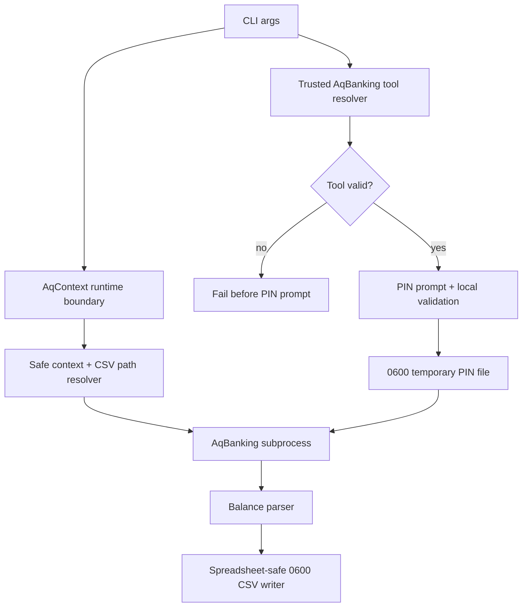

# fix: Harden Local Banking Security Boundaries

## Goal Capsule

**Objective:** Close the six actionable local security findings in the AqBanking/FinTS workflow without changing the product's local-first shape.

**Authority hierarchy:** Security findings drive the active scope; existing local-first repo posture and workspace guidance drive data-boundary choices; broader product ideas from `docs/plans/2026-07-02-001-feat-product-iterations-plan.md` stay deferred.

**Execution profile:** Standard, security-sensitive hardening. Prefer characterization coverage before changing command construction, path handling, and file writes.

**Stop conditions:** Stop and ask before adding cloud sync, storing credentials, changing AqBanking's live banking semantics, or adding a dependency that materially changes install complexity.

**Tail ownership:** The implementation is done when every finding is either fixed with tests or explicitly reclassified as accepted risk in `SECURITY.md`.

---

## Product Contract

### Summary

The current pre-alpha CLI already follows a good local-first direction: AqBanking runtime config and generated balance data live in ignored local folders, and PINs are only used interactively. The scan found that several trust boundaries are still implicit. The fix is to make those boundaries explicit in code, tests, and docs.

### Problem Frame

Personal Finance Agent is intended to touch sensitive banking data while remaining usable by a human and by an agent. That means paths, subprocesses, temporary secrets, and exported CSV content need defensive defaults. A user should not need to remember every unsafe combination of flags to avoid leaking financial data or handing a PIN to the wrong binary.

### Requirements

- R1. AqBanking executables must be resolved and validated before any PIN prompt or temporary PIN file is created.
- R2. Generated balance CSV exports must stay under the local runtime data boundary by default.
- R3. AqBanking context files must default to the runtime context path and relative overrides must resolve under the runtime data boundary.
- R4. Sensitive runtime directories and generated files must receive private permissions on POSIX systems instead of relying on the user's process umask.
- R5. CSV exports must be safe to open in spreadsheet tools by default, including values that begin with formula trigger characters.
- R6. FinTS PIN validation must reject empty values and control characters before the PIN is passed to AqBanking.
- R7. The CLI must remain agent-operable: failures should be deterministic, explainable, and testable without requiring live bank access.

### Acceptance Examples

- AE1. Given an unsafe or missing AqBanking executable, when a command uses `--safe-pin-user`, then the command fails before prompting for a PIN.
- AE2. Given a relative CSV path, when `aq balances` runs, then the export lands under the configured runtime `data/` directory.
- AE3. Given an external absolute CSV or context path, when no explicit unsafe override is present, then the CLI rejects it with a clear error.
- AE4. Given balance rows containing values such as `=cmd` or `@sum`, when the CSV is written, then those cells are neutralized for spreadsheet import.
- AE5. Given an empty PIN, a newline, a tab, a carriage return, or a null byte, when local validation runs, then validation rejects it before AqBanking sees it.
- AE6. Given an AqBanking user whose FinTS login contains a space, when `--safe-pin-user` builds a temporary PIN file, then the wrapper must either write a valid AqBanking PIN key or fail before prompting with a clear unsupported-login error.

### Scope Boundaries

#### In Scope

- Harden current AqBanking command construction, path resolution, file permissions, CSV writing, and PIN validation.
- Add unit tests that prove the new safety boundaries without requiring live bank connectivity.
- Update user-facing security and usage docs where command semantics change.

#### Deferred to Follow-Up Work

- Re-running a full repository security scan after implementation.
- Replacing AqBanking with another banking backend.
- Adding Open Banking provider integrations.
- Building the broader ledger, dashboard, LLM router, or tagging workflow from the product iteration plan.
- Adding encrypted local storage for runtime outputs.

#### Out of Scope

- Storing bank PINs, TANs, API secrets, or recovery codes.
- Public examples containing real bank identifiers, balances, or personal account metadata.
- Relaxing the local-only treatment of `data/` and AqBanking config folders.

---

## Planning Contract

### Key Technical Decisions

- KTD1. Resolve tools before prompting for PIN. The subprocess entrypoint must verify the selected AqBanking binary before `temporary_pinfile` calls `getpass`. This prevents a PATH-shadowed binary from receiving a temporary PIN file.
- KTD2. Keep one runtime root model. `AqContext` remains the authority for `config/`, `home`, `data/`, and default context paths; CLI flags should resolve through context helpers rather than building independent path behavior.
- KTD3. Make external paths opt-in. Defaults and relative paths should stay under `ctx.data_dir`. Absolute paths outside the runtime boundary should fail unless a deliberately named override flag is present.
- KTD4. Use POSIX privacy best-effort. Directory and file permission enforcement should be strict on POSIX and harmless on unsupported platforms. Existing too-open runtime paths should be tightened when the tool prepares them.
- KTD5. Sanitize at the CSV writer boundary. Balance parsing should preserve source data as structured strings; spreadsheet-safety belongs where rows are serialized to CSV.
- KTD6. Keep diagnostics secret-free. Validation and path errors may name a path or field class, but must not echo PIN values, balance values, IBANs from live output, or temporary PIN-file contents.

### High-Level Technical Design

The safest implementation shape is a preflight layer before any secret collection. The CLI resolves runtime paths and executable paths first, then prompts for a PIN only after the command target is trusted enough to run.

### Assumptions

- The repo stays dependency-light and can implement these checks with Python standard library facilities.
- AqBanking command behavior remains reachable through `aqbanking-cli` and `aqhbci-tool4`; only the wrapper's trust checks change.
- Live bank integration tests are not required for this hardening iteration.

### System-Wide Impact

This changes exported CLI behavior for users who currently pass external `--csv` or `--context` paths. The plan preserves that use case through an explicit override, but makes unsafe path selection visible and intentional.

### Risk Analysis & Mitigation

- **Risk:** Homebrew and user-installed AqBanking binaries can live in different valid paths. **Mitigation:** support absolute CLI/config overrides and validate executable properties rather than hard-coding one installation path.
- **Risk:** Spreadsheet formula mitigation changes how dangerous leading characters appear after export. **Mitigation:** document the behavior and test that ordinary balances and identifiers remain unchanged.
- **Risk:** POSIX permission enforcement can behave differently on mounted drives. **Mitigation:** use best-effort chmod with clear failures only where private files are actively created by the tool.
- **Risk:** Path rejection can surprise existing local scripts. **Mitigation:** use clear error text and a deliberately named override flag for intentional external writes.

---

## Implementation Units

### U1. Strengthen FinTS PIN Validation

**Goal:** Reject empty and control-character PINs locally before AqBanking receives them.

**Requirements:** R6, R7, AE5.

**Dependencies:** None.

**Files:** `src/personal_finance_agent/security.py`, `tests/test_security.py`, `SECURITY.md`.

**Approach:** Extend `validate_fints_pin` to require at least one character, keep the 35-character maximum, keep ASCII-only behavior, and reject non-printable/control characters such as null, newline, carriage return, and tab. Error messages should describe the class of failure without echoing the PIN.

**Patterns to follow:** Existing `validate_fints_pin` tests in `tests/test_security.py`.

**Test scenarios:**

- Valid printable ASCII PINs at length 1 and length 35 pass.
- Empty string raises `ValueError`.
- A 36-character string raises `ValueError`.
- Non-ASCII values raise `ValueError`.
- Values containing newline, carriage return, tab, or null byte raise `ValueError`.
- Error messages do not include the submitted PIN value.

**Verification:** Local validation blocks invalid shapes consistently, and existing valid PIN tests still pass.

### U2. Verify AqBanking Executables Before PIN Collection

**Goal:** Prevent a PATH-shadowed or unsafe AqBanking executable from receiving a generated PIN file.

**Requirements:** R1, R7, AE1.

**Dependencies:** U1.

**Files:** `src/personal_finance_agent/aqbanking.py`, `src/personal_finance_agent/cli.py`, `tests/test_aqbanking_tools.py`, `tests/test_security.py`.

**Approach:** Add a small resolver for `aqbanking-cli` and `aqhbci-tool4` that resolves the command to an executable path before any call to `temporary_pinfile`. It should reject missing, non-executable, or clearly unsafe locations and should allow explicit absolute overrides for users with non-standard installs. Commands that do not collect a PIN can use the same resolver for consistency.

**Execution note:** Add tests around command construction and call ordering before moving the PIN prompt boundary.

**Patterns to follow:** Existing `base`, `run_interactive`, `run_capture`, and `run_with_optional_pinfile` composition in `src/personal_finance_agent/aqbanking.py`.

**Test scenarios:**

- A valid executable path resolves and is used as the subprocess command head.
- A missing executable fails with a clear `ValueError` or `RuntimeError`.
- A non-executable file is rejected before command execution.
- A command using `--safe-pin-user` resolves the executable before invoking `getpass`.
- A failing resolver path does not create a temporary PIN file.
- Existing command argument ordering still places `--pinfile` immediately after the resolved tool path when a safe PIN user is present.
- A user config containing a `userId` with a space is handled without producing an AqBanking PIN-file parse error after PIN entry.

**Verification:** No command path can reach PIN prompting until the target executable is resolved and accepted.

### U3. Root Context and CSV Paths Under the Runtime Boundary

**Goal:** Make default and relative output paths land under `ctx.data_dir`, while making external writes explicit.

**Requirements:** R2, R3, R7, AE2, AE3.

**Dependencies:** None.

**Files:** `src/personal_finance_agent/aqbanking.py`, `src/personal_finance_agent/cli.py`, `tests/test_cli_paths.py`, `README.md`, `SECURITY.md`.

**Approach:** Add context-aware path resolution helpers. `aq balances` should default to `ctx.context_file` and `ctx.data_dir / "balances.csv"`. Relative `--context` and `--csv` values should resolve under `ctx.data_dir`; absolute paths outside the runtime boundary should fail unless an explicit unsafe override flag is present. The same helper should protect both request and list-balance context file usage.

**Patterns to follow:** Existing `AqContext.context_file` and `AqContext.data_dir` properties.

**Test scenarios:**

- With `--root` set, the default context path resolves to that root's `data/aqbanking.ctx`.
- With `--root` set, the default CSV path resolves to that root's `data/balances.csv`.
- Relative `--csv reports/balances.csv` resolves under `data/reports/balances.csv`.
- Relative `--context custom.ctx` resolves under `data/custom.ctx`.
- Absolute external `--csv` and `--context` paths are rejected without the override flag.
- Absolute external paths are accepted only when the override flag is present.
- Error messages identify the unsafe path class without printing parsed balance rows.

**Verification:** Balance export paths are deterministic from the runtime root and unsafe external writes are opt-in.

### U4. Enforce Private Runtime Permissions

**Goal:** Ensure runtime directories and generated files are private on POSIX systems.

**Requirements:** R4, R7.

**Dependencies:** U3 for final output path behavior.

**Files:** `src/personal_finance_agent/aqbanking.py`, `tests/test_file_permissions.py`, `SECURITY.md`.

**Approach:** Extend `AqContext.prepare` and CSV/context-file write paths with best-effort permission helpers. Runtime directories should be created or tightened to `0700`; generated CSV files, context files created by the wrapper, and temporary PIN files should be `0600`. Existing behavior for temporary PIN files already sets `0600`; tests should protect that behavior while covering CSV and directory paths.

**Patterns to follow:** Existing `temporary_pinfile` permission handling.

**Test scenarios:**

- Runtime `config/aqbanking.local`, `config/aqbanking.home.local`, and `data/` directories are created with private POSIX permissions.
- Existing runtime directories with permissive modes are tightened during preparation.
- Newly created CSV exports are written with private POSIX permissions.
- Appending to an existing CSV keeps or tightens private permissions.
- Permission helper behavior is skipped or harmless on platforms without POSIX chmod semantics.

**Verification:** Generated sensitive local files do not depend on a secure process umask.

### U5. Add Spreadsheet-Safe CSV Export

**Goal:** Prevent exported CSV cells from being interpreted as formulas when opened in spreadsheet software.

**Requirements:** R5, R7, AE4.

**Dependencies:** U3, U4.

**Files:** `src/personal_finance_agent/aqbanking.py`, `tests/test_csv_safety.py`, `README.md`, `SECURITY.md`.

**Approach:** Add a CSV serialization sanitizer that neutralizes string cells beginning with spreadsheet formula triggers such as `=`, `+`, `-`, `@`, tab, or carriage return. Keep `parse_balance_output` focused on parsing source output; sanitize immediately before `csv.DictWriter` writes rows. Prefer safe-by-default output over a raw default because the export is explicitly a spreadsheet-friendly surface.

**Patterns to follow:** Existing `append_csv` writer boundary.

**Test scenarios:**

- Cells beginning with `=`, `+`, `-`, `@`, tab, and carriage return are neutralized in the written CSV.
- Normal balance strings and ordinary identifiers are not changed.
- Header rows are not corrupted by the sanitizer.
- Appending additional rows applies the same sanitizer consistently.
- Empty exports still print the current no-row message and do not create an empty file unnecessarily.

**Verification:** A CSV generated from hostile source-like values is safe to open in spreadsheet tools without formula execution.

### U6. Update Security Docs and Regression Coverage

**Goal:** Make the hardened behavior discoverable and preserve it through future product work.

**Requirements:** R1, R2, R3, R4, R5, R6, R7.

**Dependencies:** U1, U2, U3, U4, U5.

**Files:** `README.md`, `SECURITY.md`, `docs/open-source.md`, `tests/test_security.py`, `tests/test_aqbanking_tools.py`, `tests/test_cli_paths.py`, `tests/test_csv_safety.py`, `tests/test_file_permissions.py`.

**Approach:** Update docs to describe safe path defaults, explicit external-path overrides, private file behavior, safe CSV exports, and tool-resolution expectations. Keep examples generic and avoid real bank identifiers. Consolidate test names around the six finding IDs where useful so future security scans can map fixes back to the original findings.

**Patterns to follow:** Existing concise README and `docs/open-source.md` security rules.

**Test scenarios:**

- Documentation examples use generic placeholders only.
- Documentation examples use runtime-root-safe defaults.
- Regression tests cover one happy path and one failure path for each fixed finding.
- No tests require live banking, real AqBanking config, or personal account data.

**Verification:** A future maintainer can understand the security boundary from docs and test names without access to the original scan artifact.

---

## Verification Contract

| Gate | Applies To | Required Outcome |
|---|---|---|
| Unit coverage | U1-U6 | Tests prove valid, boundary, and failure behavior for each security finding. |
| Existing suite | All units | The current unittest suite remains green after the new tests are added. |
| Secret hygiene review | U2-U6 | No test fixtures, docs, or error messages include real PINs, TANs, IBANs, balances, or user bank identifiers. |
| CLI contract review | U2-U3 | Existing command names stay stable; new unsafe override behavior is explicit and documented. |
| Manual dry-run | U2-U5 | Tool resolution, path rejection, CSV writing, and permission behavior can be exercised without live bank access. |

The full security scan can be repeated after implementation, but it is not required to begin this plan. If it is repeated, PFA-2026-001 through PFA-2026-006 should no longer reproduce or should be downgraded with documented rationale.

---

## Definition of Done

- PFA-2026-001 through PFA-2026-006 are fixed or explicitly documented as accepted risk.
- `validate_fints_pin` rejects empty, non-ASCII, overlong, and control-character values without echoing the PIN.
- `--safe-pin-user` cannot prompt for a PIN before AqBanking executable preflight succeeds.
- Default and relative CSV/context paths resolve under the runtime data directory.
- External path usage requires an explicit override and emits clear diagnostics when omitted.
- Runtime directories and generated sensitive files receive private POSIX permissions where supported.
- CSV exports are spreadsheet-safe by default.
- README, security docs, and open-source direction remain free of personal banking identifiers.
- All added tests are deterministic and require no live banking access.
- Dead-end experimental helpers or unused abstractions are removed before landing.

---

## Appendix

### Sources & Research

- Codex Security scan `51690b35b34f_20260702T103008Z`.
- Current AqBanking implementation in `src/personal_finance_agent/aqbanking.py`.
- Current CLI implementation in `src/personal_finance_agent/cli.py`.
- Current PIN validation in `src/personal_finance_agent/security.py`.
- Existing tests in `tests/test_security.py`.
- Existing security posture in `README.md`, `SECURITY.md`, and `docs/open-source.md`.
- Product iteration context in `docs/plans/2026-07-02-001-feat-product-iterations-plan.md`.
